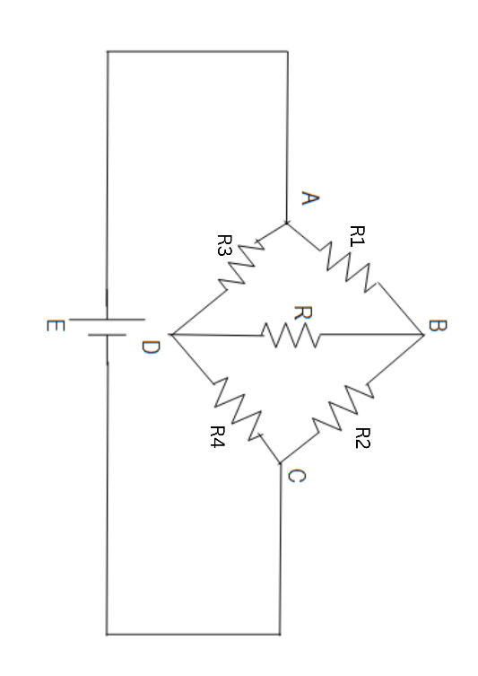

Hexaware 2025 on-campus hiring

1.  Smallest element of an array.

Test case 1:

Input: 5

\[1,2,3,4,5\]

Output: 1

Test case 2:

Input: 6

\[4,1,2,9,0,7\]

Output: 0

2.  Middle element of an array after removing negative values

Test case 1:

Input: 6

\[3,-1,7,-4,9,2\]

Output: 7

Test case 2:

Input: 5

\[-5,10,-3,20,30\]

Output: 20

3.  Wheatstone bridge

Formula for wheat stone bridge is given by:

R1/R2 = R3/R4

Given values of three resistors, R1, R2, R3 find the value of the
missing one, R4.

Testcase 1:

Input: 5, 10, 3

Output: 6

Testcase 2:

Input: 6, 3, 2

Output: 1

